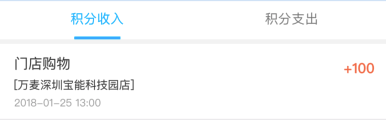
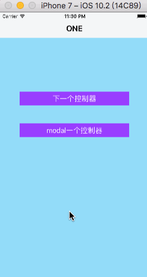
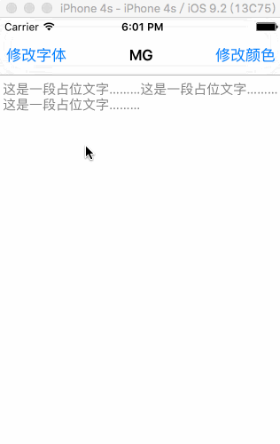

# 开发中封装的框架
## 01-BNVCContainer
```objc
继承
	xx : BNVCContainer
重写数组
	- (NSArray<BNCToolbarItem *> *)items {
添加子控制器
	[self addController:vc];
	有需要updateRootView的位置
```


## 02-CommonCell
快速构建个人页

## 03-CheckBox
勾选同意

## 04-AlertController
封装弹窗提示

## 05-MGNaVBackBarButtonItem

统一设置导航控制器的返回按钮，modal和push模式

- 控制器继承`MGBaseViewController`即可
  - 首页的`leftBarButtonItem`不用设置
  - 不用设置push控制器和modal出来控制的返回leftBarButtonItem
  - 统一设置能处理2种情况的返回<br>



## 06-MGPlaceholderTextView
用label实现占位文字的textView，可修改颜色，字体
```objc
// 添加一个MGPlaceholderTextView
MGPlaceholderTextView *textView = [[MGPlaceholderTextView alloc] init];
textView.frame = self.view.bounds;
textView.placeholder = @"这是一段占位文字………这是一段占位文字………这是一段占位文字………";
[self.view addSubview:textView];
```


## X-Waterflow

瀑布流框架，不常用
```objc
@class MGWaterflowLayout;

@protocol MGWaterflowLayoutDelegate <NSObject>
@required
- (CGFloat)waterflowLayout:(MGWaterflowLayout *)waterflowLayout heightForItemAtIndex:(NSUInteger)index itemWidth:(CGFloat)itemWidth;

@optional
- (NSInteger)columnCountInWaterflowLayout:(MGWaterflowLayout *)waterflowLayout;
- (CGFloat)columnMarginInWaterflowLayout:(MGWaterflowLayout *)waterflowLayout;
- (CGFloat)rowMarginInWaterflowLayout:(MGWaterflowLayout *)waterflowLayout;
- (UIEdgeInsets)edgeInsetsInWaterflowLayout:(MGWaterflowLayout *)waterflowLayout;
@end

@interface MGWaterflowLayout : UICollectionViewLayout
/** 代理 */
@property (nonatomic, weak) id<MGWaterflowLayoutDelegate> delegate;
@end
```